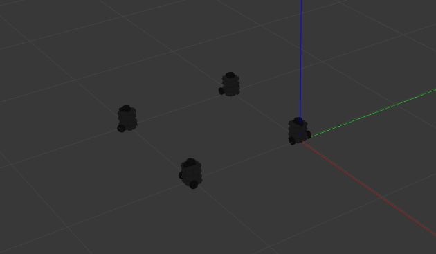

# turtlebot3_formation
Multi-Robot Formation Control Algorithm Implementation Using ROS (Noetic), Gazebo, Turtlebot3. 

* Leader-Follower
* Virtual Structure 



## Getting Started

```bash
# 1. Create a ROS workspace;replace <workspace_name> with your own workspace name.
$ mkdir <workspace_name>/src
$ cd <workspace_name>/src

# 2. Install dependencies and repository
# turtlebot3_msg`, `turtlebot3`, `turtlebot3_simulation`, `dynamic_reconfigure`, `joint-state-publisher`
# Your can either build it from source or install using `apt`

# 3. Build the Project
$ cd <workspace_name>
$ catkin_make
$ source devel/setup.bash

# 4. Run
# for example, leader-follwer
$ roslaunch turtlebot3_formation leader_follower.launch

# 5. Drive robot 1
$ rostopic pub -r 10 /tb3_1/cmd_vel geometry_msgs/Twist "{linear:  {x: 0.2, y: 0.0, z: 0.0}, angular: {x: 0.0,y: 0.0, z: 0.1}}"
```

## Reference
[1]. [abc_swarm doc](https://abc-swarm.readthedocs.io/en/latest/index.html). 

[2]. leader-follower

[3]. Virtual Structure

